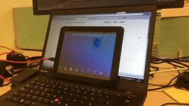
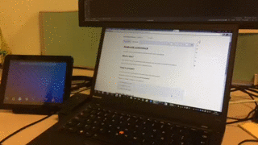

# AndroidLockUnlock
A system to lock and unlock password protected Android devices automatically.

##What's this?
If you need to securize your Android device with password, lock and unlock it frecuently can be tedious.

Here you can see how AndroidLockUnlock will make your life easier.



##How to prepare
First you need to have added adb.exe to the path or place the bat file on the same location.

Remember to edit the file and **write your device password**.

Now you can execute it directly from command line:

```
C:\>lockunlock.bat unlock

C:\>lockunlock.bat lock

C:\>lockunlock.bat toggle
```

##Create file shortcut

You can add a file shortcut.

1. Rename lockunlock.bat to lockunlock.exe
2. Drag it to your taskbar
3. Rename lockunlock.exe back to lockunlock.bat
4. Shift + Right click on the file shortcut you have just created on taskbar
5. Click on Properties
6. On Shortcut tab, replace "lockunlock.exe" by "lockunlock.bat toggle" on Target
7. Save changes



##Invoke it when PC lock or unlock

You can lock your device when your computer locks. And you can unlock it when your computer unlocks.

[Schedule a task](http://windows.microsoft.com/en-au/windows/schedule-task#1TC=windows-7)